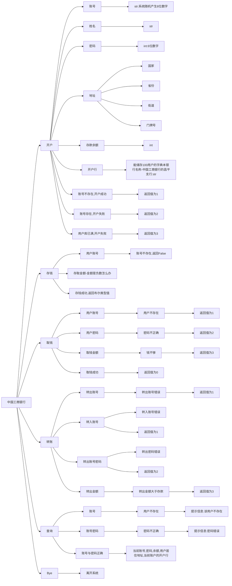

```mermaid
graph LR
A[中国工商银行]-->B[开户]
A-->C[存钱]
A-->D[取钱]
A-->E[转账]
A-->F[查询]
A-->H[Bye]

B-->I[账号]
I-->I1[str:系统随机产生8位数字]
B-->J[姓名]
J-->J1[str]
B-->K[密码]
K-->K1[int:6位数字]
B-->L[地址]
L-->L1[国家]
L-->L2[省份]
L-->L3[街道]
L-->L4[门牌号]
B-->M[存款余额]
M-->M1[int]
B-->N[开户行]
N-->N1[能储存100用户的字典本银行名称-中国工商银行的昌平支行:str]
B-->B1[账号不存在,开户成功]
B1-->B11[返回值为1]
B-->B2[账号存在,开户失败]
B2-->B21[返回值为2]
B-->B3[用户库已满,开户失败]
B3-->B31[返回值为3]

C-->O[用户账号]
O-->O1[账号不存在,返回False]
C-->P[存取金额-金额是负数怎么办]
C-->C1[存钱成功,返回布尔类型值]


D-->Q[用户账号]
Q-->Q1[用户不存在]
Q1-->Q11[返回值为1]
D-->R[用户密码]
R-->R1[密码不正确]
R1-->R11[返回值为2]
D-->S[取钱金额]
S-->S1[钱不够]
S1-->S11[返回值为3]
D-->D1[取钱成功]
D1-->D11[返回值为0]

E-->T[转出账号]
T-->T1[转出账号错误]
T1-->T11[返回值为1]
E-->U[转入账号]
U-->U1[转入账号错误]
U-->U11[返回值为1]
E-->V[转出账号密码]
V-->V1[转出密码错误]
V-->V11[返回值为2]
E-->W[转出金额]
W-->W1[转出金额大于存款]
W1-->W11[返回值为3]

F-->X[账号]
X-->X1[用户不存在]
X1-->X11[提示信息:该用户不存在]
F-->Y[账号密码]
Y-->Y1[密码不正确]
Y1-->Y11[提示信息:密码错误]
F-->F1[账号与密码正确]
F1-->F11[当前账号,密码,余额,用户居住地址,当前账户的开户行]

H-->Z[离开系统]

```

